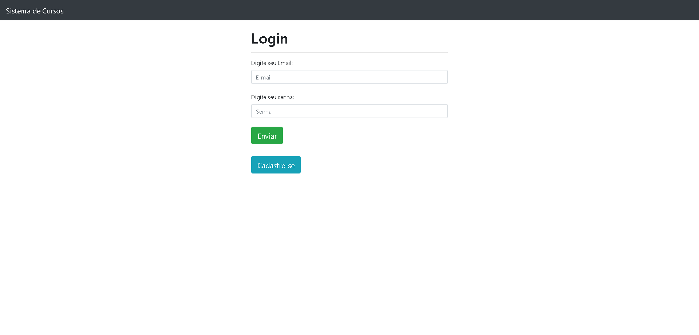
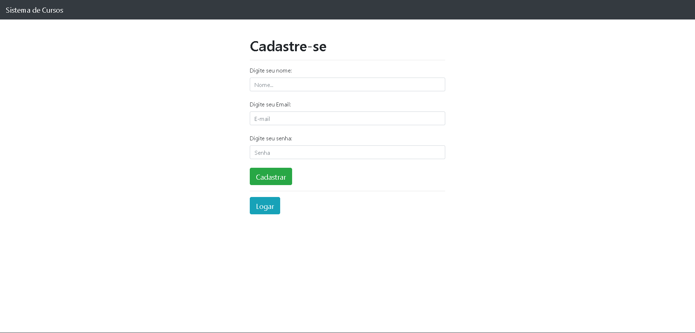
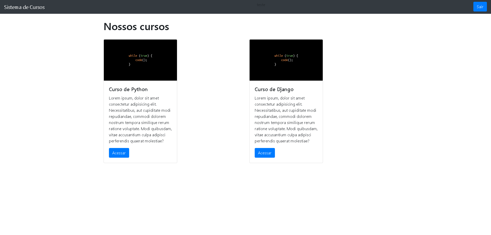
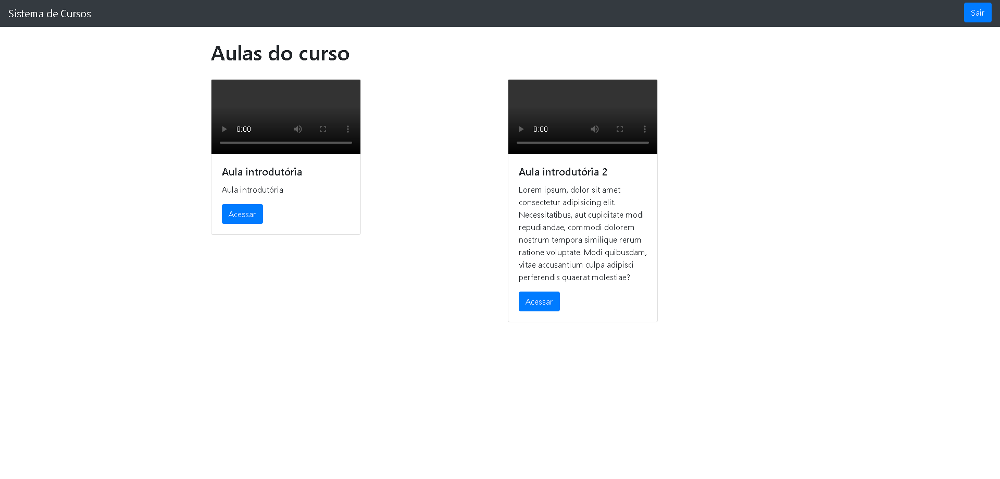
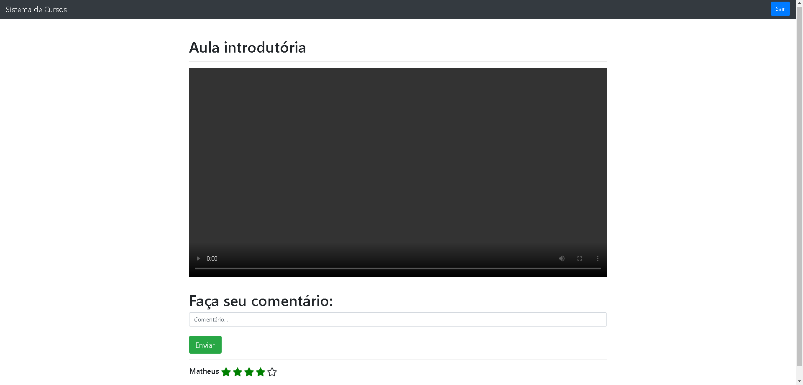

# Plataforma de cursos

O projeto tem como objetivo de cadastrar e logar pessoas que querem cursos. Empresas podem registar cursos e aulas, nas aulas existe os comentários e o voto de cada pessoa logada no site

___

___

## Tecnologias 🖥️

- Python
- Bootstrap
- Django
- SQLite
- Git e Github

___

## Contato ✉️

matheusssalmeida@yahoo.com.br